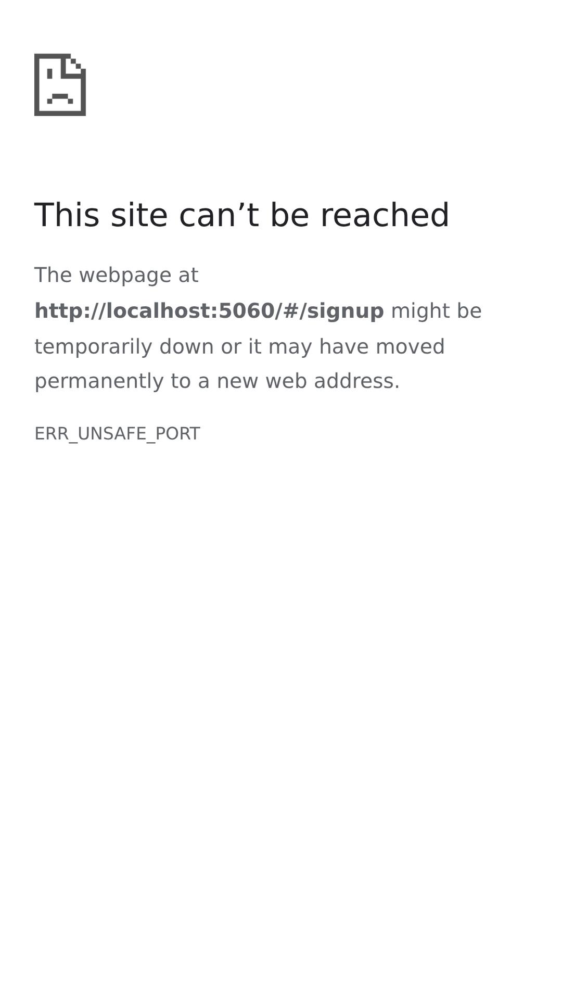
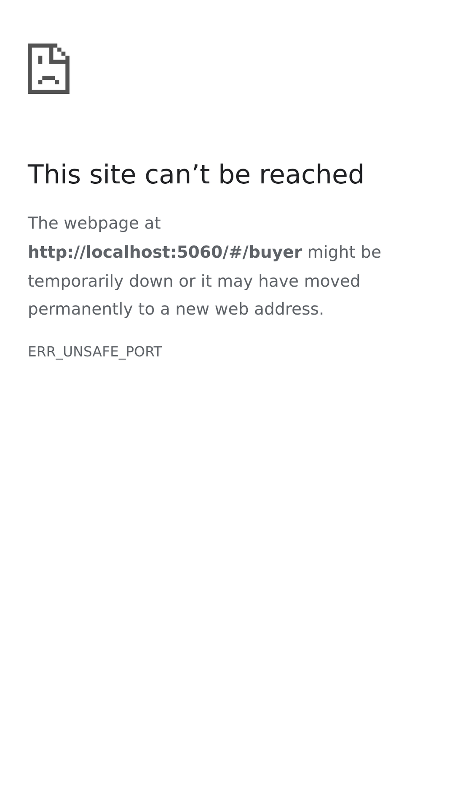
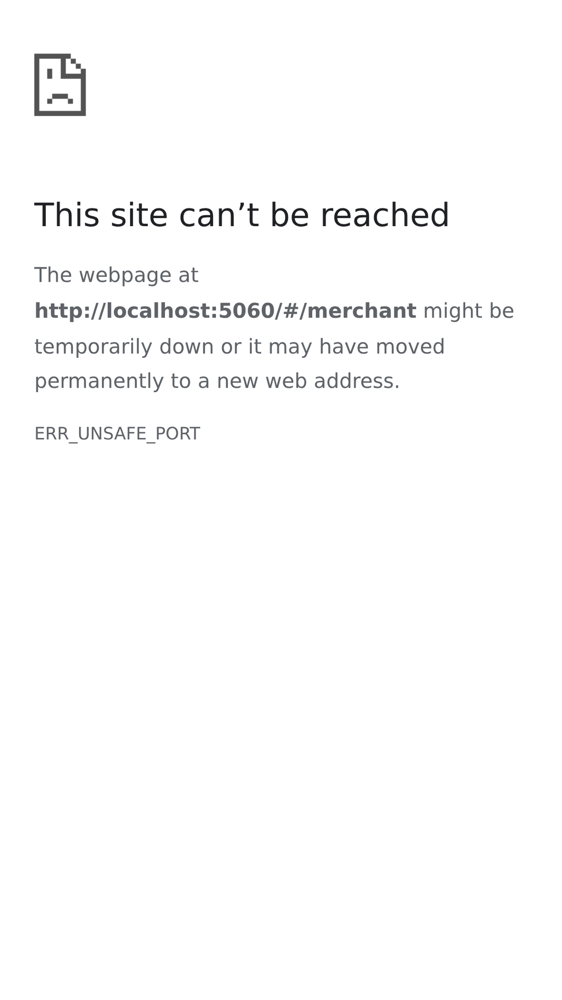
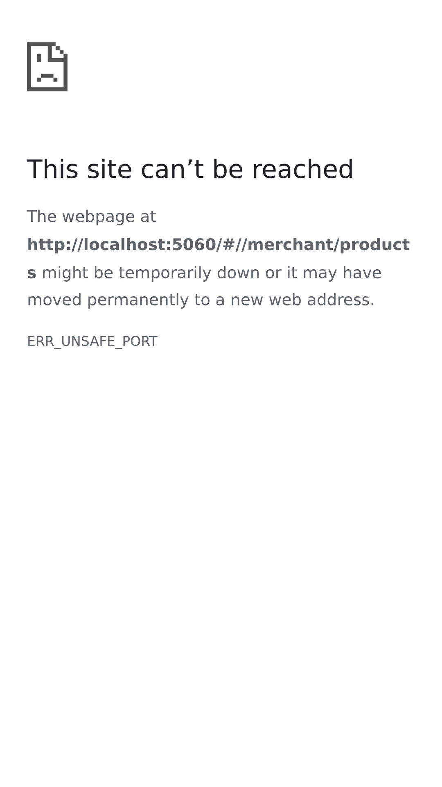
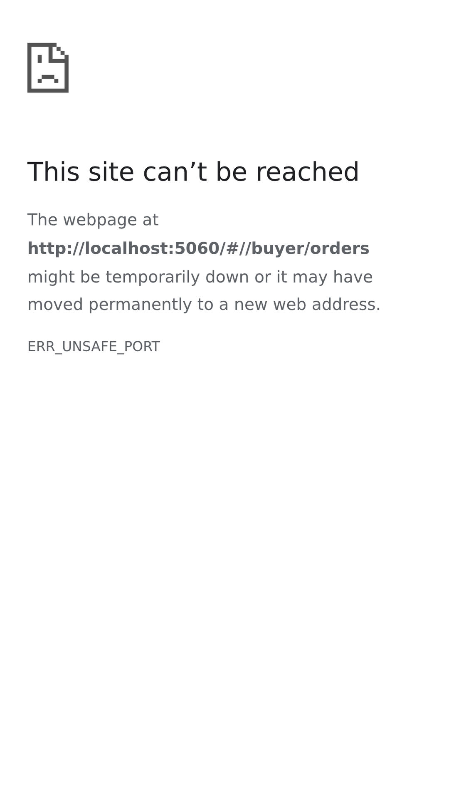

# 🌟 زهرة الأمل - سوق السودان الذكي

<div align="center">


**منصة التجارة الإلكترونية الشاملة التي تجمع المشترين والبائعين ومكاتب التوصيل في مكان واحد**

[](https://flutter.dev)
[](https://dart.dev)
[](https://firebase.google.com)
[](LICENSE)

[🌐 تجربة حية](https://your-demo-url.com) • [📱 تحميل APK](releases) • [📖 الوثائق](docs) • [🐛 إبلاغ عن خطأ](issues)

</div>

---

## 📋 جدول المحتويات

- [حول المشروع](#-حول-المشروع)
- [المميزات الرئيسية](#-المميزات-الرئيسية)
- [لقطات الشاشة](#-لقطات-الشاشة)
- [التقنيات المستخدمة](#-التقنيات-المستخدمة)
- [البدء](#-البدء)
- [هيكل المشروع](#-هيكل-المشروع)
- [المساهمة](#-المساهمة)
- [الترخيص](#-الترخيص)
- [التواصل](#-التواصل)

---

## 📖 حول المشروع

**زهرة الأمل** هي منصة تجارة إلكترونية متكاملة مصممة خصيصاً للسوق السوداني. تجمع المنصة بين المشترين والتجار ومكاتب التوصيل في نظام واحد متكامل مع واجهة عربية سهلة الاستخدام.

### 🎯 الهدف

توفير حل تجاري شامل يسهل عمليات البيع والشراء والتوصيل في السودان، مع التركيز على:
- 🛡️ **الأمان**: نظام مصادقة آمن مع Firebase
- 🚀 **الأداء**: تطبيق سريع ومستجيب
- 🎨 **تجربة المستخدم**: واجهة عربية احترافية
- 📱 **التوافق**: يعمل على Android و Web

---

## ✨ المميزات الرئيسية

### 👤 للمشترين
- 🛍️ تصفح آلاف المنتجات من متاجر موثوقة
- ❤️ إضافة المنتجات للمفضلة
- 📦 تتبع الطلبات في الوقت الفعلي
- 💳 خيارات دفع آمنة ومتعددة
- ⭐ تقييم المنتجات والمتاجر
- 📍 إدارة عناوين التوصيل المتعددة

### 🏪 للتجار
- 🏬 إنشاء متجر إلكتروني بسهولة
- 📊 إدارة المنتجات والمخزون
- 📈 متابعة الطلبات والمبيعات
- 💰 تقارير مالية تفصيلية
- 📱 إشعارات فورية بالطلبات الجديدة
- 🎯 إحصائيات الأداء

### 🚚 لمكاتب التوصيل
- 📍 إدارة عمليات التوصيل بكفاءة
- 👥 تتبع السائقين والطلبات
- 🗺️ تحديد مناطق التغطية
- 📊 إحصائيات وتقارير الأداء
- 💵 إدارة الحسابات المالية

### 🔧 للإداريين
- 👥 إدارة المستخدمين والصلاحيات
- 📦 إدارة المنتجات والفئات
- 📊 تقارير تحليلية شاملة
- ⚙️ إعدادات المنصة
- 🔍 مراقبة النشاطات

---

## 📸 لقطات الشاشة

<div align="center">

### 🔐 تسجيل الدخول والتسجيل
 

### 🏠 الصفحة الرئيسية ولوحات التحكم
 

### 🏪 إدارة المتجر والمنتجات
 

### 📦 الطلبات والتوصيل
 

</div>

---

## 🛠️ التقنيات المستخدمة

### Frontend
- **Flutter 3.35.4** - إطار العمل الرئيسي
- **Dart 3.9.2** - لغة البرمجة
- **Material Design 3** - نظام التصميم

### Backend & Services
- **Firebase Authentication** - نظام المصادقة والأمان
- **Cloud Firestore** - قاعدة بيانات في الوقت الفعلي
- **Firebase Storage** - تخزين الملفات والصور

### State Management & Storage
- **Provider 6.1.5** - إدارة الحالة
- **Hive 2.2.3** - قاعدة بيانات محلية
- **SharedPreferences 2.5.3** - تخزين الإعدادات

### UI & Networking
- **Cached Network Image** - تحميل الصور بكفاءة
- **Shimmer** - تأثيرات التحميل
- **HTTP 1.5.0** - طلبات الشبكة

---

## 🚀 البدء

### المتطلبات الأساسية

قبل البدء، تأكد من تثبيت:

- [Flutter 3.35.4](https://flutter.dev/docs/get-started/install) أو أحدث
- [Dart 3.9.2](https://dart.dev/get-dart) أو أحدث
- [Android Studio](https://developer.android.com/studio) أو [VS Code](https://code.visualstudio.com/)
- حساب [Firebase](https://firebase.google.com/) (للخدمات السحابية)

### التثبيت

1. **استنساخ المشروع:**
```bash
git clone https://github.com/YOUR_USERNAME/zahrat-amal-app.git
cd zahrat-amal-app
```

2. **تثبيت الحزم:**
```bash
flutter pub get
```

3. **إعداد Firebase:**
- أنشئ مشروع Firebase جديد
- أضف تطبيق Android
- حمّل ملف `google-services.json` وضعه في `android/app/`
- أنشئ ملف `lib/firebase_options.dart` (راجع الوثائق)

4. **تشغيل التطبيق:**
```bash
# تشغيل في وضع Debug
flutter run

# بناء للإصدار
flutter build apk --release
```

---

## 📁 هيكل المشروع

```
lib/
├── main.dart                 # نقطة الدخول الرئيسية
├── firebase_options.dart     # إعدادات Firebase
│
├── screens/                  # شاشات التطبيق
│   ├── buyer/               # شاشات المشتري
│   ├── merchant/            # شاشات التاجر
│   ├── delivery/            # شاشات التوصيل
│   └── admin/               # شاشات الإدارة
│
├── services/                # خدمات النظام
│   ├── auth_service.dart    # خدمة المصادقة
│   └── user_service.dart    # خدمة المستخدمين
│
├── models/                  # نماذج البيانات
│   └── user_model.dart
│
└── widgets/                 # مكونات قابلة لإعادة الاستخدام
    └── common_widgets.dart

android/                     # تكوين Android
web/                        # تكوين Web
assets/                     # الأصول (صور، أيقونات)
```

---

## 🔧 التكوين

### إعداد Firebase

1. **إنشاء مشروع Firebase:**
   - اذهب إلى [Firebase Console](https://console.firebase.google.com/)
   - أنشئ مشروع جديد

2. **تفعيل الخدمات:**
   - Authentication (Email/Password)
   - Cloud Firestore
   - Storage (اختياري)

3. **إضافة التطبيق:**
   - أضف تطبيق Android
   - حمّل `google-services.json`
   - ضعه في `android/app/`

4. **إنشاء `firebase_options.dart`:**
```dart
// مثال مبسط - استخدم FlutterFire CLI للإنشاء الآلي
class DefaultFirebaseOptions {
  static FirebaseOptions get currentPlatform {
    return android; // أو web حسب المنصة
  }
  
  static const FirebaseOptions android = FirebaseOptions(
    apiKey: 'YOUR_API_KEY',
    appId: 'YOUR_APP_ID',
    messagingSenderId: 'YOUR_SENDER_ID',
    projectId: 'YOUR_PROJECT_ID',
  );
}
```

---

## 🤝 المساهمة

المساهمات مرحب بها دائماً! إليك كيفية المساهمة:

1. **Fork المشروع**
2. **أنشئ فرع للميزة** (`git checkout -b feature/AmazingFeature`)
3. **Commit التغييرات** (`git commit -m 'إضافة ميزة رائعة'`)
4. **Push للفرع** (`git push origin feature/AmazingFeature`)
5. **افتح Pull Request**

### إرشادات المساهمة

- 📝 اكتب كود نظيف ومنظم
- ✅ اختبر التغييرات قبل الإرسال
- 📖 وثّق الميزات الجديدة
- 🌐 حافظ على دعم اللغة العربية

---

## 📝 خارطة الطريق

- [x] نظام مصادقة كامل مع Firebase
- [x] واجهات المشتري والتاجر
- [x] إدارة الطلبات والتوصيل
- [x] لوحات تحكم الإدارة
- [ ] نظام الدفع الإلكتروني
- [ ] تطبيق iOS
- [ ] إشعارات Push
- [ ] الدردشة المباشرة
- [ ] تطبيق للسائقين

---

## 📄 الترخيص

هذا المشروع مرخص تحت رخصة MIT - راجع ملف [LICENSE](LICENSE) للتفاصيل.

```
MIT License

Copyright (c) 2025 ZahratAmal

Permission is hereby granted, free of charge, to any person obtaining a copy
of this software and associated documentation files...
```

---

## 📞 التواصل

**فريق زهرة الأمل**

- 📧 البريد الإلكتروني: support@zahrat.sd
- 🌐 الموقع: [zahrat-amal.com](https://zahrat-amal.com)
- 📱 Twitter: [@ZahratAmal](https://twitter.com/ZahratAmal)
- 💼 LinkedIn: [ZahratAmal](https://linkedin.com/company/zahratamal)

**رابط المشروع:** [https://github.com/YOUR_USERNAME/zahrat-amal-app](https://github.com/YOUR_USERNAME/zahrat-amal-app)

---

## 🙏 شكر وتقدير

- [Flutter](https://flutter.dev) - إطار العمل الرائع
- [Firebase](https://firebase.google.com) - الخدمات السحابية
- [Material Design](https://material.io) - نظام التصميم
- المجتمع السوداني المبدع 🇸🇩

---

## 📊 الإحصائيات


---

<div align="center">

**صُنع بـ ❤️ في السودان 🇸🇩**

إذا أعجبك المشروع، لا تنسَ إضافة ⭐ على GitHub!

[⬆ العودة للأعلى](#-زهرة-الأمل---سوق-السودان-الذكي)

</div>
